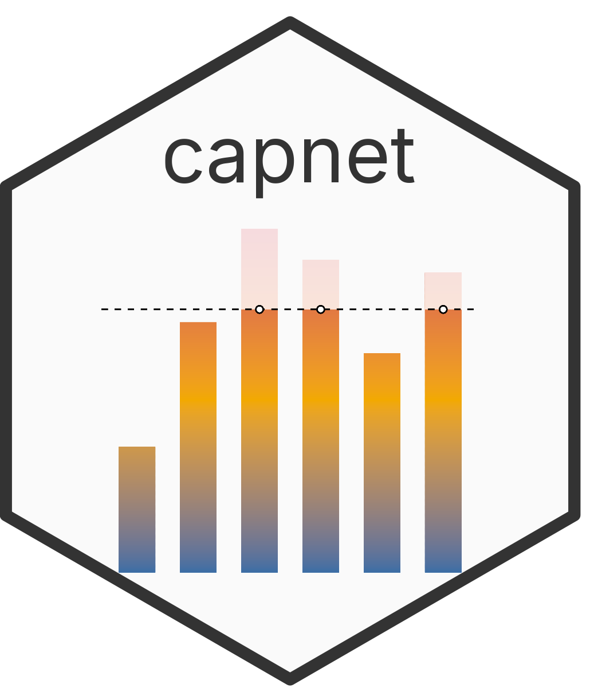
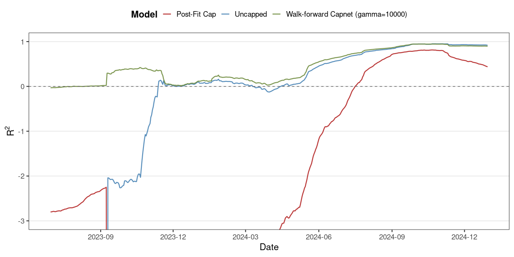
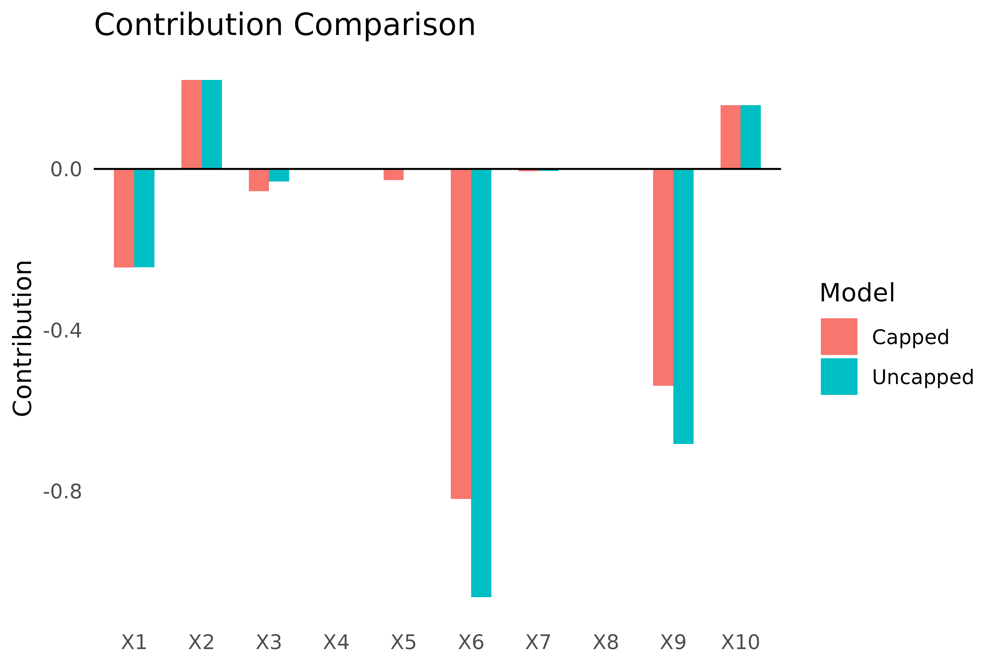

# capnet

**Contribution-capped elastic net regularization for R.**

A differentiable penalty on what each feature *actually does to a prediction* — not just the size of its coefficient. Ships with GLM support (Gaussian, binomial, Poisson, Gamma), cross-validation, walk-forward backtesting, and diagnostic plotting, fit end-to-end with a custom OWL-QN/L-BFGS objective built on the `lbfgs` package.


---

## A single feature can break a model — here's the proof

<p align="center"></p>

Forecasting next-day Wikipedia pageviews from 30 heavy-tailed content series with a Poisson GLM: a single article's traffic spike sends an otherwise-reasonable **uncapped** model's rolling out-of-sample pseudo-R² to a minimum of **&minus;212,135** — one bad day the model needs the rest of the year to recover from. Post-fit truncation (cap the prediction *after* fitting, the standard industry workaround) barely helps. `capnet`, given the exact same features and family, holds pseudo-R² near **+0.44** straight through the spike — by bounding each feature's realized log-scale contribution *during* estimation, not shrinking its coefficient in the abstract.

| Method | γ | OOS pseudo-R² |
|---|---:|---:|
| Uncapped GLM | – | &minus;9,461 |
| Post-fit capping (truncate after fitting) | – | &minus;1.43 |
| **capnet** | 10,000 | **+0.438** |

*Full backtest: Jan 2023 – Dec 2024, monthly refits on live Wikimedia pageview data. See `manuscript/main.tex`, §5.2.*

This is the same mechanism `capnet` was built to solve in production: a market-timing pipeline at [Hull Tactical Asset Allocation](https://hulltactical.com), where a single fat-tailed feature can otherwise hijack an already-regularized model's predictions.

## Why this exists

Financial and web-scale features are routinely fat-tailed, and the extreme values are often real signal — a regime shift, a viral spike — not noise to discard. Standard L1/L2 penalties don't help: they shrink *coefficients*, not realized influence, so a feature with an occasional extreme value can still swing a prediction whenever that value occurs, "small" coefficient or not. The usual workarounds — winsorization, outlier filtering, post-fit truncation — throw away exactly the information that made the extreme value informative, with no guarantee they've actually bounded the model's dependence on any given feature.

`capnet` penalizes the *deployed* effect of each feature directly. It's a portfolio-construction idea applied to regression: concentrating a portfolio in one asset increases risk; concentrating a model's predictive weight in one feature increases model risk. `capnet` bounds that concentration explicitly, per feature, while still letting the optimizer use the full training signal — including the extremes.

The same mechanism generalizes past finance to credit scoring and fairness-constrained models (bounding a sensitive or proxy covariate's influence), clinical risk scores (a single noisy biomarker shouldn't dominate), and any regression over unstable or non-stationary feature scales.

## Results at a glance

A second backtest, on a cross-sectional equity dataset with a Gaussian model and a rolling 20-year training window, shows the same pattern at a smaller scale — `capnet` matches or beats an uncapped elastic net while comfortably beating post-fit capping, because it's the only one of the three that lets coefficients *reallocate* around the constraint instead of just clipping the output:

| Method | γ | OOS R² |
|---|---:|---:|
| Uncapped elastic net | – | 0.00706 |
| Post-fit capping | – | 0.00573 |
| **capnet** | 100 | **0.00766** |

Runtime stays in the same order of magnitude as `glmnet` for a single fit/CV cycle:

| Model | Monthly-refit backtest runtime |
|---|---:|
| `glmnet` | 13.1s |
| `capnet` | 16.1s |
| `walk_capnet` (per-row refit) | 58.9s |

## Methodology

`capnet` fits a GLM under an elastic net penalty augmented with a smooth contribution-cap penalty:

```math
\min_{\beta_0,\ \beta}\ \; \ell(\beta_0, \beta;\, X, y) \;+\; \lambda\Big(\alpha\|\beta\|_1 + (1-\alpha)\|\beta\|_2^2\Big) \;+\; \gamma \sum_{i,j} \max\big(0,\ |\beta_j Z_{ij} \cdot m_i| - L_j\big)^2
```

- `ℓ` is the negative log-likelihood for `family` (`gaussian`, `binomial`, `poisson`, or `Gamma` with a log link).
- `λ`, `α` are the usual elastic net strength and L1/L2 mixing parameter.
- `Z` is an evaluation matrix (defaults to `X`) on which contributions are measured — it can differ from the training data, e.g. an out-of-sample or live-trading feature matrix.
- `L` is a per-feature contribution ceiling; `m` (`multiplier`) optionally rescales contributions row-by-row (e.g. per-observation notional or exposure) without touching the likelihood term.
- `γ` controls how strongly cap violations are penalized; `γ = 0` recovers plain elastic net.

The cap penalty is a squared hinge, smooth enough for quasi-Newton optimization without a constrained solver: **OWL-QN** is used whenever the L1 term is active, plain **L-BFGS** otherwise, both via the `lbfgs` package's C++ backend. A detail that matters in practice: when `standardize = TRUE` (the default), the likelihood and ridge terms are optimized on standardized variables for numerical stability, but the cap penalty and its gradient are always mapped back to the original, unstandardized contribution scale first — via an explicit chain-rule correction — so `L` and `Z` stay in the same units as the raw data regardless of the standardization setting.

See the [paper draft](manuscript/main.tex) for the full derivation and both worked case studies above.

## Engineering notes

- **Verified gradients.** Each of the four supported GLM families has a hand-derived analytic gradient, checked against numerical (finite-difference) gradients in a dedicated regression suite (`tests/testthat/test-gradients.R`) — including a regression test for a scale-invariance bug in the contribution-cap gradient's chain-rule term.
- **Two optimizers, one objective.** OWL-QN and L-BFGS are routed automatically based on whether the L1 term is active, both wired directly to the `lbfgs` package rather than a generic black-box optimizer.
- **Standardization done right.** Optimization happens on standardized data for numerical conditioning, but the cap penalty — the part users actually reason about — is always defined and enforced in the original feature scale.
- **Box constraints via gradient masking**, K-fold cross-validation and walk-forward evaluation with automatic `gamma` back-off on non-convergence, and parallel dispatch over folds/steps via `parallel::makeCluster()`.
- **Idiomatic R package design.** S3 classes (`capnet`, `cv_capnet`, `walk_capnet`, `capnet_path`) with `coef()`, `predict()`, and `plot()` methods, `glmnet`-compatible `alpha`/`lambda` conventions, and roxygen2-generated documentation throughout.

## Installation

```r
remotes::install_github("harryziyuhe/capnet")
```

## Quick start

```r
library(capnet)

# Simulated data with a suggested per-feature contribution cap
d <- simulate_capnet_data(n = 200, p = 15, seed = 1)

fit <- capnet(d$X, d$y, L = d$L, alpha = 0.5, lambda = 0.1, gamma = 1)

coef(fit)
fit$feature_contributions   # per-row, per-feature contribution to the fit

# Any row/feature still exceeding its cap?
capnet_violations(fit)
```

Select hyperparameters by cross-validation, then compare against an uncapped fit:

```r
cv <- cv_capnet(d$X, d$y, gamma = 1, L = d$L)

fit_capped   <- capnet(d$X, d$y, L = d$L, alpha = cv$best_alpha,
                        lambda = cv$best_lambda, gamma = 1)
fit_uncapped <- capnet(d$X, d$y, L = d$L, alpha = cv$best_alpha,
                        lambda = cv$best_lambda, gamma = 0)

plot_redistribution(fit_uncapped, fit_capped, plot = "delta")
```

<p align="center"></p>

`walk_capnet()` runs the same fit across a time-ordered evaluation matrix, one window at a time, retrying with a smaller `gamma` if the optimizer fails to converge:

```r
out <- walk_capnet(d$X, d$y, L = d$L, z = d$X, walk = 1,
                    alpha = 0.5, lambda = 0.1, gamma = 1)
```

## API

| Function | Description |
|---|---|
| `capnet()` | Fit a single elastic net + contribution-cap model |
| `cv_capnet()` | K-fold cross-validation over an `alpha` x `lambda` grid (`gamma`, `L` fixed) |
| `walk_capnet()` | Walk-forward refitting and out-of-sample prediction over an evaluation matrix |
| `coef_path()` | Coefficients along a `lambda` (or other hyperparameter) path |
| `capnet_violations()` | Which (row, feature) pairs exceed their contribution cap |
| `plot_redistribution()` | Visualize how coefficients/contributions shift as caps tighten |
| `simulate_capnet_data()` | Synthetic data generator (Gaussian/binomial/Poisson/Gamma, with an optional unstable-feature "proxy" mode) for examples and benchmarking |

`cv_capnet()` and `walk_capnet()` both accept `parallel = TRUE` to dispatch independent fits across a `parallel::makeCluster()` cluster.

## Supported families

`gaussian` (identity link), `binomial` (logit), `poisson` (log), and `Gamma` (log link only — the log link, not `stats::Gamma()`'s inverse-link default, is what matches this package's loss and gradient). Pass `family` as a string, a family-generating function, or a family object, same as `glm()`.

## Relationship to `glmnet`

`capnet` is not a performance-oriented replacement for `glmnet` — it targets the narrower case where you need a differentiable cap on realized feature contributions, which off-the-shelf coordinate-descent solvers can't express. Where the two overlap (`gamma = 0`), `capnet` is designed as a rough drop-in, using the same `alpha`/`lambda` conventions; where they diverge, `capnet` trades `glmnet`'s coordinate-descent speed for OWL-QN/L-BFGS generality over an arbitrary evaluation matrix `Z` and row-wise `multiplier`.

## Documentation

- `vignette("capnet")` — contribution-cap formulation, optimization strategy, and cross-domain use cases
- `vignette("cap_comparison")`, `vignette("compare_mu")` — capped vs. uncapped comparisons
- `vignette("example_elan")`, `vignette("example_wiki")` — the worked case studies above (Gaussian market-timing, Poisson web-traffic)
- [`manuscript/main.tex`](manuscript/main.tex) — full paper draft (JSS format)

## Development

```r
devtools::install_deps()
devtools::document()
devtools::test()
devtools::check()
```

## License

MIT © Harry He
